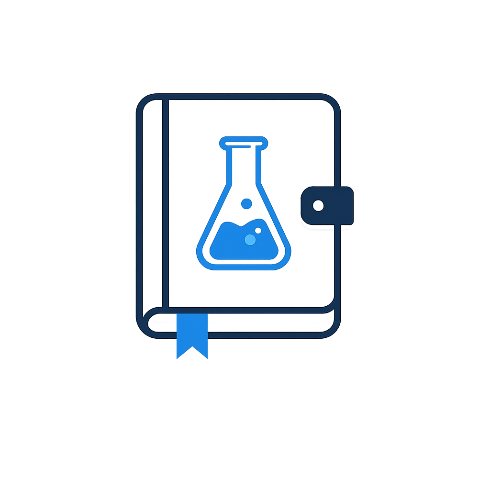
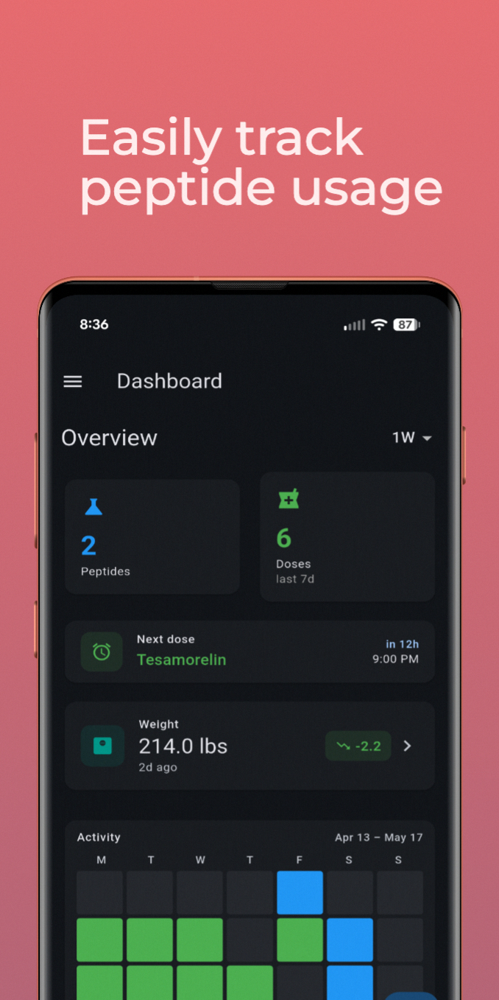
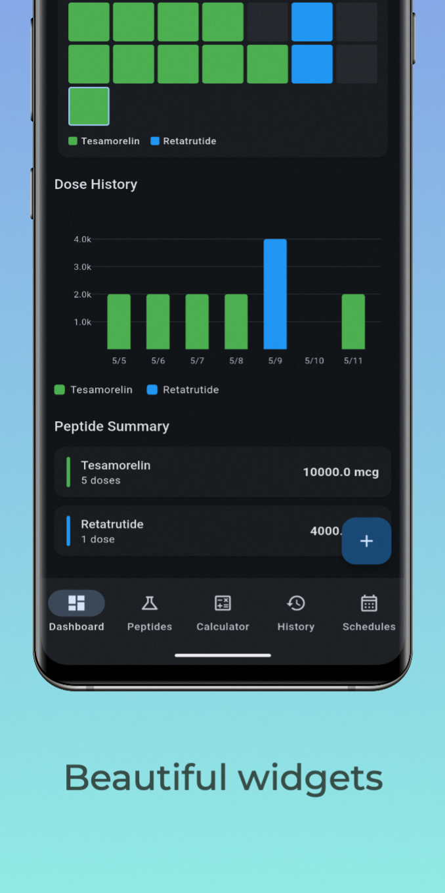
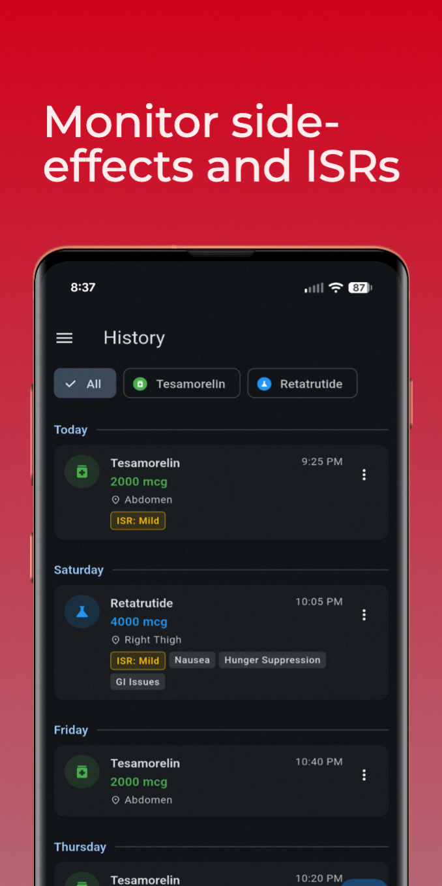
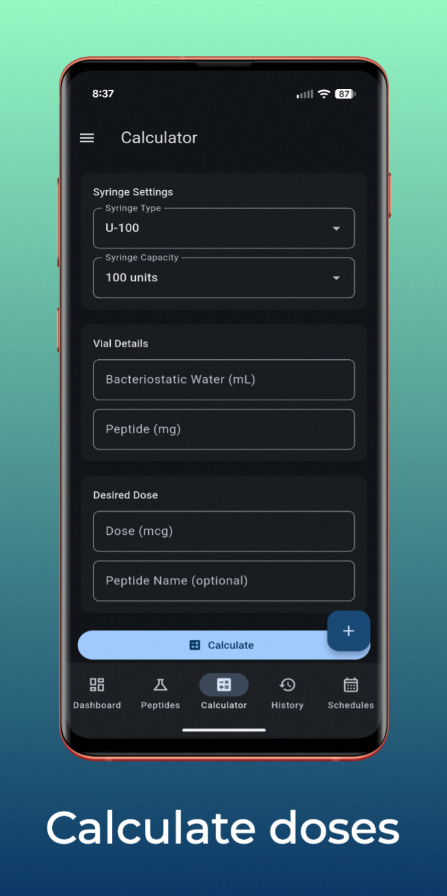
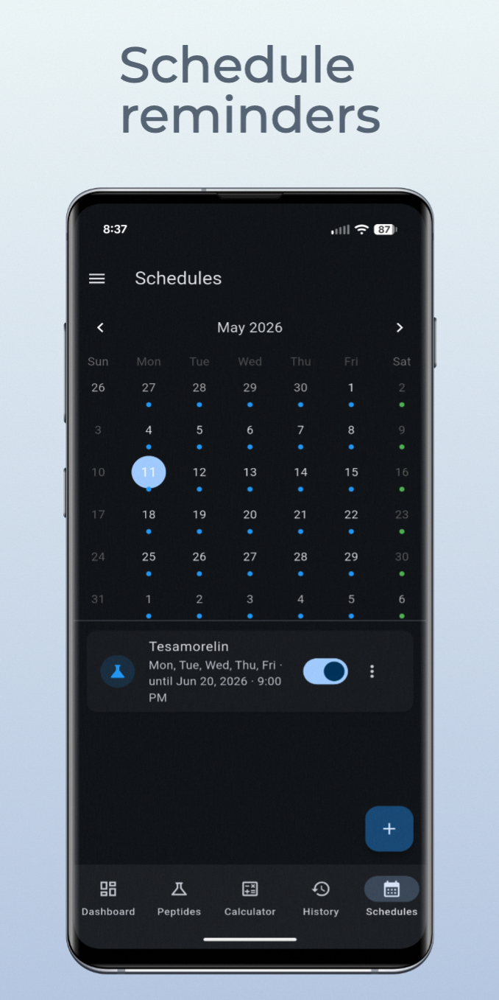
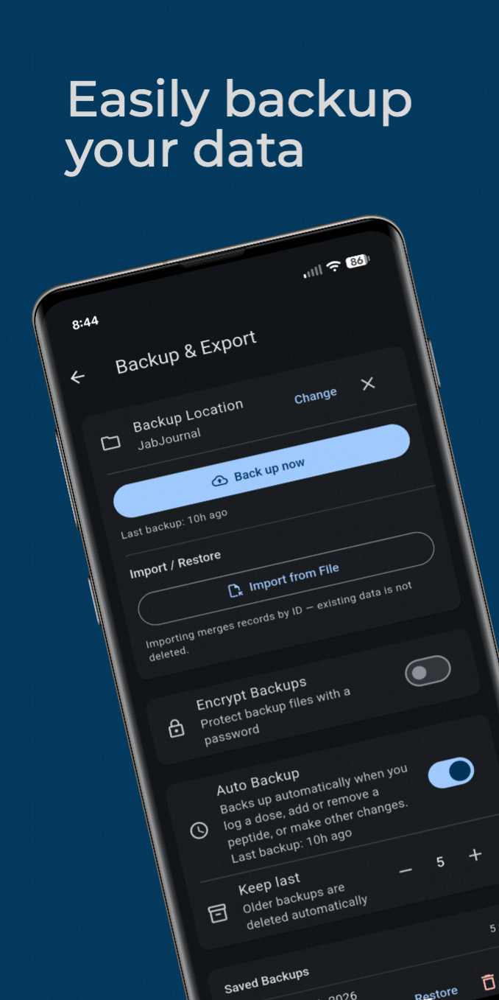

<p align="center">
  
</p>

<h1 align="center">JabJournal</h1>

<p align="center">
  An offline-first app for tracking peptide doses, injection calculations, and schedules.<br>
  Currently available on Android, with iOS support coming soon.
</p>

<p align="center">
  <a href="https://github.com/JabJournal/JabJournal/releases/latest">
    
  </a>
</p>

> [!IMPORTANT]
> This app was created with the help of Claude Code. If you do not like that, please refrain from using the app.

> [!WARNING]
> This app is not intended for clinical use. Always consult a qualified healthcare provider for medical advice.

## Screenshots

<table align="center">
  <tr>
    <td></td>
    <td></td>
    <td></td>
  </tr>
  <tr>
    <td></td>
    <td></td>
    <td></td>
  </tr>
</table>

## Features

- **Free. Forever.** — no ads, no subscription fees. Core features of the app will always remain free and open-source.
- **Peptide Management** — add, edit, and delete peptides with vendor and dosage info
- **Dose Logging** — record doses with injection site, side effects, and ISR severity
- **Injection Calculator** — compute draw amounts from vial/syringe specs and desired dose
- **Schedules** — set recurring or one-time dose reminders (daily, weekly, specific dates)
- **Weight Tracking** — log weight entries, optionally linked to a dose
- **Dashboard** — summary stats and charts across all tracked data
- **Offline-First** — all data stored locally in SQLite; works with no internet connection
- **Automatic Data Backups** — your data is just that. Yours. Automatically backup your data and restore it from a backup if needed.
- **Cloud Sync** — optional Supabase integration for backup and multi-device access (currently untested)
- **Local Notifications** — timezone-aware dose reminders with a foreground service on Android

## Getting Started

### Prerequisites

- Flutter 3.8.1+ / Dart 3.4.0+
- Xcode (iOS/macOS builds)
- Android Studio (Android builds)

### Install dependencies

```bash
flutter pub get
```

### Run the app

```bash
flutter run -d iphone    # iOS simulator or device
flutter run -d android   # Android emulator or device
flutter run -d macos     # macOS desktop
flutter run -d chrome    # Web (development)
flutter run -d windows   # Windows desktop
```

### Other commands

```bash
flutter analyze          # Lint (Dart analyzer + flutter_lints)
flutter test             # Run all tests
flutter build apk        # Build Android APK
flutter clean            # Clear build artifacts
```

## Cloud Sync Setup (Optional. Currently untested.)

By default the app runs fully offline. To enable Supabase sync, update `lib/config/app_config.dart`:

```dart
class AppConfig {
  static const String supabaseUrl = 'YOUR_SUPABASE_PROJECT_URL';
  static const String supabaseAnonKey = 'YOUR_SUPABASE_ANON_KEY';
}
```

See [SETUP.md](SETUP.md) for the full SQL schema to create the required Supabase tables.

## Architecture

```
Screens (lib/screens/)
    ↓
Providers (lib/providers/)   — ChangeNotifier, consumed via Provider / context.watch
    ↓
Services (lib/services/)     — business logic and I/O
    ↓
Models (lib/models/)         — toMap/fromMap + toJson/fromJson
```

State management uses 11 `ChangeNotifier` providers wired in `main.dart` via `MultiProvider`. The local database is SQLite (via `sqflite`), currently at schema version 3. Every row carries a `sync_status` column (`pending` | `synced` | `failed`) and a `remote_id` for Supabase sync.

### Project Structure

```
lib/
├── main.dart
├── config/          # AppConfig (Supabase credentials, sync interval)
├── models/          # Peptide, DoseHistory, PeptideSchedule, PeptideCalculation, WeightEntry
├── providers/       # Domain providers (peptides, doses, schedules, calculator, weight, …)
├── screens/
│   ├── home/        # Shell with 5-tab bottom nav
│   ├── peptides/
│   ├── doses/
│   ├── calculator/
│   ├── schedules/
│   ├── weight/
│   └── settings/
├── services/
│   ├── database/    # SQLiteService (singleton + migrations), DatabaseHelper (CRUD)
│   ├── supabase/    # SupabaseService, SyncManager
│   ├── notification_service.dart
│   ├── foreground_service.dart
│   └── notification_router.dart
└── utils/
```

## Contributing

PRs are welcome! If you have a bug fix, feature idea, or improvement, feel free to open an issue to discuss it or submit a pull request directly. Please keep changes focused — one logical change per PR.
